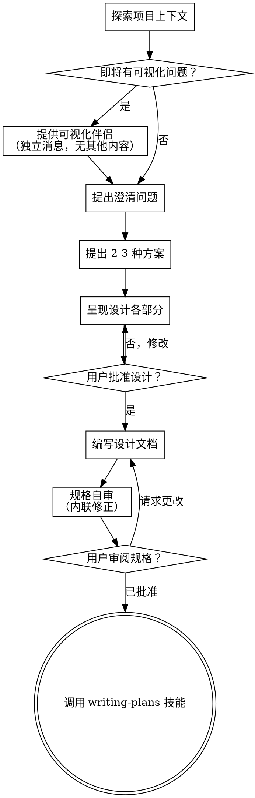

# 将想法头脑风暴为设计

通过自然的协作对话，帮助将想法转化为完整的设计和规格说明。

首先了解当前项目上下文，然后一次一个问题地完善想法。一旦你理解你要构建什么，呈现设计并获取用户批准。

<HARD-GATE>
在呈现设计并获得用户批准之前，不要调用任何实现技能、编写任何代码、搭建任何项目或采取任何实现行动。这适用于每个项目，无论其看似多么简单。
</HARD-GATE>

## 反模式："这太简单了，不需要设计"

每个项目都要经过这个流程。一个待办事项列表、一个单函数工具、一个配置更改——所有这些都需要。在"简单"项目中，未经审视的假设会导致最多浪费的工作。设计可以很短（对于真正简单的项目只需几句话），但你必须呈现它并获得批准。

## 检查清单

你必须为以下每一项创建一个任务，并按顺序完成：

1. **探索项目上下文** — 检查文件、文档、最近的提交记录
2. **提供可视化伴侣**（如果主题将涉及可视化问题）— 这是独立的一条消息，不要与澄清问题合并。参见下方的可视化伴侣部分。
3. **提出澄清问题** — 一次一个，理解目的/约束/成功标准
4. **提出 2-3 种方案** — 包含权衡和你的推荐
5. **呈现设计** — 各部分按其复杂程度成比例展开，每个部分之后获取用户批准
6. **编写设计文档** — 保存到 `docs/superpowers/specs/YYYY-MM-DD-<主题>-design.md` 并提交
7. **规格自审** — 快速内联检查占位符、矛盾、歧义、范围（见下文）
8. **用户审阅书面规格** — 在继续之前要求用户审阅规格文件
9. **过渡到实现** — 调用 writing-plans 技能来创建实现计划

## 流程

**终端状态是调用 writing-plans。** 不要调用 frontend-design、mcp-builder 或任何其他实现技能。头脑风暴之后你唯一调用的技能是 writing-plans。

## 流程

**理解想法：**

- 首先检查当前项目状态（文件、文档、最近的提交记录）
- 在询问详细问题之前，评估范围：如果请求描述了多个独立子系统（例如，"构建一个包含聊天、文件存储、计费和分析的平台"），立即标记。不要花费大量问题来细化一个需要首先分解的项目的细节。
- 如果项目对于单个规格来说太大，帮助用户分解为子项目：哪些是独立的部分，它们如何关联，应按什么顺序构建？然后通过正常的设计流程对第一个子项目进行头脑风暴。每个子项目经历自己的 规格 → 计划 → 实现 循环。
- 对于范围适当的项目，一次一个问题地完善想法
- 尽可能优先使用选择题，但开放式问题也可以
- 每条消息只提一个问题——如果某个主题需要更多探索，将其拆分为多个问题
- 重点理解：目的、约束、成功标准

**探索方案：**

- 提出 2-3 种不同的方案及其权衡
- 以对话方式呈现选项，附上你的推荐和理由
- 首先介绍你推荐的选项并解释原因

**呈现设计：**

- 一旦你相信你理解了你要构建什么，就呈现设计
- 每个部分按其复杂程度成比例展开：如果简单直接，只需几句话；如果有细微差别，最多 200-300 字
- 在每个部分之后询问目前看起来是否合适
- 涵盖：架构、组件、数据流、错误处理、测试
- 准备好在某些内容不合理时回头澄清

**为隔离和清晰而设计：**

- 将系统分解为较小的单元，每个单元有一个清晰的目的，通过定义良好的接口通信，并且可以独立理解和测试
- 对于每个单元，你应该能够回答：它做什么，如何使用它，以及它依赖什么？
- 他人能否在不阅读内部实现的情况下理解一个单元做什么？你能在不破坏消费者的情况下更改内部实现吗？如果不能，边界需要改进。
- 较小、边界清晰的单元也更容易让你处理——你能更好地推理一次可以放入上下文中的代码，并且当文件聚焦时，你的编辑更可靠。当一个文件变得很大时，这通常是一个信号，表明它做了太多事情。

**在现有代码库中工作：**

- 在提出更改之前探索当前结构。遵循现有模式。
- 当现有代码存在影响工作的问题时（例如，一个变得太大的文件、不清晰的边界、纠缠不清的职责），将有针对性的改进包含在设计中——就像一个优秀的开发者在他们工作的代码中做出改进一样。
- 不要提出无关的重构。专注于服务当前目标的内容。

## 设计之后

**文档：**

- 将经过验证的设计（规格）写入 `docs/superpowers/specs/YYYY-MM-DD-<主题>-design.md`
  - （用户对规格位置的偏好覆盖此默认值）
- 如果可用，使用 elements-of-style:writing-clearly-and-concisely 技能
- 将设计文档提交到 git

**规格自审：**
在编写规格文档之后，用新的眼光审视它：

1. **占位符扫描：** 有任何"TBD"、"TODO"、不完整的部分或模糊的需求吗？修正它们。
2. **内部一致性：** 各部分之间是否有矛盾？架构是否与功能描述匹配？
3. **范围检查：** 这对于单个实现计划来说够聚焦吗，还是需要分解？
4. **歧义检查：** 任何需求是否可以被两种不同的方式解释？如果是，选择一种并明确表达。

内联修正任何问题。无需重新审阅——修正后继续。

**用户审阅关卡：**
在规格审阅循环通过后，在继续之前要求用户审阅书面规格：

> "规格已编写并提交到 `<路径>`。请审阅它，如果你在我们开始编写实现计划之前想做任何更改，请告诉我。"

等待用户回应。如果他们请求更改，进行更改并重新运行规格审阅循环。只有在用户批准后才继续。

**实现：**

- 调用 writing-plans 技能来创建详细的实现计划
- 不要调用任何其他技能。writing-plans 是下一步。

## 关键原则

- **一次一个问题** - 不要用多个问题让人应接不暇
- **优先选择题** - 比开放式问题更容易回答
- **无情地应用 YAGNI** - 从所有设计中移除不必要的功能
- **探索替代方案** - 在确定之前总是提出 2-3 种方案
- **增量验证** - 呈现设计，在继续之前获得批准
- **保持灵活** - 当某些内容不合理时回头澄清

## 可视化伴侣

一个基于浏览器的伴侣，用于在头脑风暴期间展示模型、图表和可视化选项。作为工具可用——不是一种模式。接受伴侣意味着它可用于受益于可视化处理的问题；这并不意味着每个问题都要通过浏览器。

**提供伴侣：** 当你预计即将出现的问题将涉及可视化内容（模型、布局、图表）时，提出一次以获得同意：
> "我们正在做的一些工作可能更容易通过我在网页浏览器中向你展示的方式来解释。我可以随着进展制作模型、图表、对比和其他可视化内容。这个功能仍然较新，可能会消耗大量 token。想试试吗？（需要打开一个本地 URL）"

**这个提议必须是独立的一条消息。** 不要将其与澄清问题、上下文摘要或任何其他内容合并。该消息应只包含上述提议，不包含其他任何内容。在继续之前等待用户回应。如果他们拒绝，继续仅使用文本进行头脑风暴。

**逐问题决策：** 即使用户接受了，对每个问题决定使用浏览器还是终端。检验标准：**用户通过看比通过读更能理解这个问题吗？**

- **使用浏览器** 用于确实可视化的内容——模型、线框图、布局对比、架构图、并排的视觉设计
- **使用终端** 用于文本内容——需求问题、概念选择、权衡列表、A/B/C/D 文本选项、范围决策

涉及 UI 主题的问题并不自动是可视化问题。"人格在这个上下文中是什么意思？"是一个概念性问题——使用终端。"哪种向导布局更好？"是一个可视化问题——使用浏览器。

如果他们同意伴侣，在继续之前阅读详细指南：
`skills/brainstorming/visual-companion.md`
