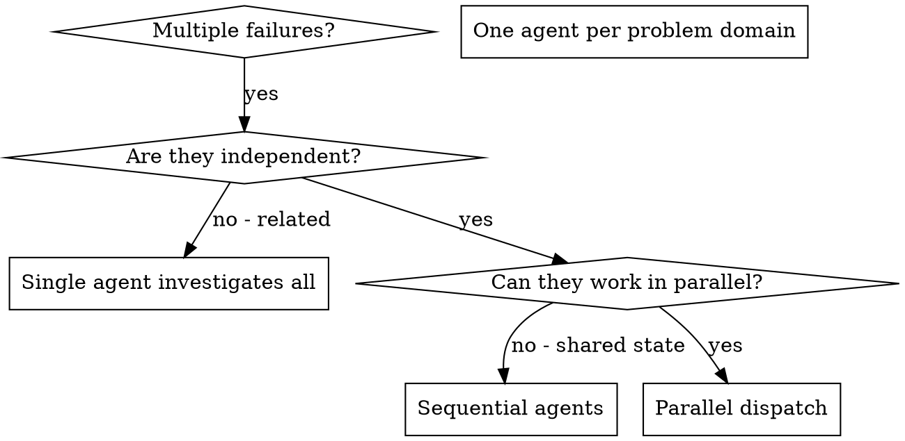

# 并行智能体调度

## 概览

你将任务委派给具有隔离上下文的专用智能体。通过精确构建它们的指令和上下文，你可以确保它们专注于并成功完成各自的任务。它们绝不应继承你当前会话的上下文或历史——你只构建它们所需的内容。这也能为你自己的协调工作保留上下文。

当你遇到多个不相关的失败（不同的测试文件、不同的子系统、不同的 bug）时，逐一排查是在浪费时间。每个排查工作都是独立的，可以并行进行。

**核心原则：** 每个独立的问题领域派一个智能体。让它们并发工作。

## 何时使用



**适用场景：**
- 3 个以上测试文件因不同根因而失败
- 多个子系统各自独立地出问题
- 每个问题可以在不了解其他问题上下文的情况下被理解
- 排查工作之间没有共享状态

**不适用场景：**
- 失败是相关的（修复一个可能会解决其他的）
- 需要了解完整的系统状态
- 智能体会互相干扰

## 模式

### 1. 识别独立领域

将失败按出问题的部分分组：
- 文件 A 测试：工具审批流程
- 文件 B 测试：批量完成行为
- 文件 C 测试：中止功能

每个领域都是独立的——修复工具审批不会影响中止测试。

### 2. 创建专注的智能体任务

每个智能体获得：
- **明确的范围：** 一个测试文件或子系统
- **清晰的目标：** 让这些测试通过
- **约束条件：** 不要改其他代码
- **预期输出：** 你发现和修复了什么的摘要

### 3. 并行调度

```typescript
// In Claude Code / AI environment
Task("Fix agent-tool-abort.test.ts failures")
Task("Fix batch-completion-behavior.test.ts failures")
Task("Fix tool-approval-race-conditions.test.ts failures")
// All three run concurrently
```

### 4. 审查与集成

当智能体返回时：
- 阅读每个摘要
- 验证修复不会冲突
- 运行完整的测试套件
- 集成所有更改

## 智能体提示词结构

好的智能体提示词是：
1. **专注的** — 一个明确的问题领域
2. **自包含的** — 包含理解问题所需的所有上下文
3. **对输出具体的** — 智能体应该返回什么？

```markdown
修复 src/agents/agent-tool-abort.test.ts 中的 3 个失败测试：

1. "should abort tool with partial output capture" - 期望消息中包含 'interrupted at'
2. "should handle mixed completed and aborted tools" - 快速工具被中止而非完成
3. "should properly track pendingToolCount" - 期望 3 个结果但得到 0

这些是时序/竞态条件问题。你的任务：

1. 阅读测试文件并理解每个测试验证什么
2. 识别根因——是时序问题还是实际 bug？
3. 通过以下方式修复：
   - 将任意超时替换为基于事件的等待
   - 如果发现中止实现中的 bug，进行修复
   - 如果测试的期望值因行为变化而变化，调整测试期望

不要只是增加超时——找到真正的问题。

返回：你发现和修复了什么的摘要。
```

## 常见错误

**❌ 范围太宽：** "修好所有测试"——智能体会迷失方向
**✅ 范围具体：** "修复 agent-tool-abort.test.ts"——专注的范围

**❌ 无上下文：** "修复竞态条件"——智能体不知道在哪里
**✅ 有上下文：** 贴出错误信息和测试名称

**❌ 无约束：** 智能体可能重构一切
**✅ 有约束：** "不要改动生产代码"或"只修复测试"

**❌ 输出模糊：** "修好它"——你不知道改了什么
**✅ 输出具体：** "返回根因和更改的摘要"

## 何时不应使用

**相关失败：** 修复一个可能会解决其他的——先一起排查
**需要完整上下文：** 理解需要看到整个系统
**探索式调试：** 你还不确定哪里出了问题
**共享状态：** 智能体会互相干扰（编辑相同的文件，使用相同的资源）

## 来自会话的真实案例

**场景：** 大规模重构后，3 个文件中出现 6 个测试失败

**失败：**
- agent-tool-abort.test.ts：3 个失败（时序问题）
- batch-completion-behavior.test.ts：2 个失败（工具未执行）
- tool-approval-race-conditions.test.ts：1 个失败（执行次数 = 0）

**决策：** 独立领域——中止逻辑与批量完成与竞态条件互不相关

**调度：**
```
智能体 1 → 修复 agent-tool-abort.test.ts
智能体 2 → 修复 batch-completion-behavior.test.ts
智能体 3 → 修复 tool-approval-race-conditions.test.ts
```

**结果：**
- 智能体 1：将超时替换为基于事件的等待
- 智能体 2：修复事件结构 bug（threadId 放错了位置）
- 智能体 3：添加等待以确保异步工具执行完成

**集成：** 所有修复各自独立，没有冲突，整个测试套件全绿

**节省的时间：** 与顺序排查相比，3 个问题并行解决

## 核心优势

1. **并行化** — 多个排查同时进行
2. **专注** — 每个智能体范围狭窄，需要跟踪的上下文更少
3. **独立性** — 智能体之间不会互相干扰
4. **速度** — 3 个问题在 1 个问题的时间内解决

## 验证

智能体返回后：
1. **审查每个摘要** — 理解哪些地方发生了变化
2. **检查冲突** — 智能体有没有编辑相同的代码？
3. **运行完整套件** — 验证所有修复能一起工作
4. **抽查** — 智能体可能会产生系统性错误

## 真实世界影响

来自调试会话（2025-10-03）：
- 3 个文件中出现 6 个失败
- 并行调度 3 个智能体
- 所有排查并发完成
- 所有修复成功集成
- 智能体更改之间零冲突
