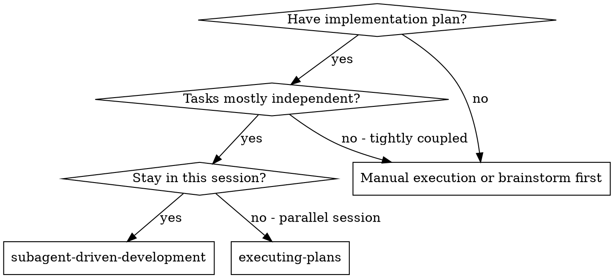
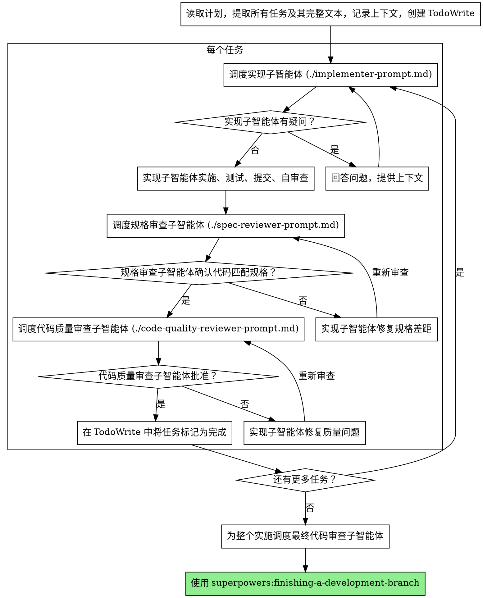

# 子智能体驱动开发

通过为每个任务调度全新的子智能体来执行计划，每个任务后进行两阶段审查：先是规格合规审查，然后是代码质量审查。

**为什么用子智能体：** 你将任务委派给具有隔离上下文的专用智能体。通过精确构建它们的指令和上下文，你可以确保它们专注于并成功完成各自的任务。它们绝不应继承你当前会话的上下文或历史——你只构建它们所需的内容。这也能为你自己的协调工作保留上下文。

**核心原则：** 每个任务派一个全新子智能体 + 两阶段审查（规格再质量）= 高质量，快速迭代

**持续执行：** 不要在任务之间停下来向你的 人类搭档 汇报。不加中断地执行计划中的所有任务。唯一停下来的原因是：你无法解决的 BLOCKED 状态、真正阻碍进展的模糊性，或所有任务已完成。"我应该继续吗？"的提示和进度摘要浪费他们的时间——他们要求你执行计划，所以执行就是了。

## 何时使用



**与执行计划（并行会话）对比：**
- 同一会话（无需上下文切换）
- 每个任务全新子智能体（无上下文污染）
- 每个任务后进行两阶段审查：先是规格合规，然后是代码质量
- 更快迭代（任务之间不需要人为介入）

## 流程



## 模型选择

使用能够胜任每个角色且能力最低的模型，以节省成本并提高速度。

**机械性实现任务**（隔离的函数、清晰的规格、1-2 个文件）：使用快速、便宜的模型。当计划被充分指定时，大多数实现任务属于机械性工作。

**集成和判断性任务**（多文件协调、模式匹配、调试）：使用标准模型。

**架构、设计和审查任务**：使用可用的能力最强的模型。

**任务复杂度信号：**
- 涉及 1-2 个文件且具有完整规格 → 便宜模型
- 涉及多个文件且有集成问题 → 标准模型
- 需要设计判断或广泛的代码库理解 → 能力最强的模型

## 处理实现子智能体状态

实现子智能体报告四种状态之一。适当地处理每种状态：

**DONE：** 进入规格合规审查。

**DONE_WITH_CONCERNS：** 实现者完成了工作但标记了疑虑。在继续之前阅读顾虑。如果顾虑与正确性或范围有关，在审查之前解决它们。如果它们属于观察性意见（如"这个文件变大了"），记录下来然后进入审查。

**NEEDS_CONTEXT：** 实现者需要未提供的信息。提供缺失的上下文并重新调度。

**BLOCKED：** 实现者无法完成任务。评估阻碍：
1. 如果是上下文问题，提供更多上下文并用同一模型重新调度
2. 如果任务需要更多推理能力，用更强的模型重新调度
3. 如果任务太大，将其拆分为更小的部分
4. 如果计划本身有误，上报给 人类

**绝不要** 忽略上报，或在不做任何改变的情况下强迫同一模型重试。如果实现者说它卡住了，必须有所改变。

## 提示词模板

- `./implementer-prompt.md` - 调度实现子智能体
- `./spec-reviewer-prompt.md` - 调度规格合规审查子智能体
- `./code-quality-reviewer-prompt.md` - 调度代码质量审查子智能体

## 示例工作流

```
你：我正在使用子智能体驱动开发来执行此计划。

[读取计划文件一次：docs/superpowers/plans/feature-plan.md]
[提取所有 5 个任务及其完整文本和上下文]
[创建包含所有任务的 TodoWrite]

任务 1：Hook 安装脚本

[获取任务 1 的文本和上下文（已提取）]
[使用完整任务文本 + 上下文调度实现子智能体]

实现者："在开始之前——hook 应该安装在用户级别还是系统级别？"

你："用户级别（~/.config/superpowers/hooks/）"

实现者："明白。正在实施……"
[稍后] 实现者：
  - 实现了 install-hook 命令
  - 添加了测试，5/5 通过
  - 自审查：发现我遗漏了 --force 标志，已添加
  - 已提交

[调度规格合规审查员]
规格审查员：✅ 规格合规——所有要求已满足，无多余内容

[获取 git SHA，调度代码质量审查员]
代码审查员：优点：测试覆盖率良好，干净整洁。问题：无。已批准。

[将任务 1 标记为完成]

任务 2：恢复模式

[获取任务 2 的文本和上下文（已提取）]
[使用完整任务文本 + 上下文调度实现子智能体]

实现者：[无问题，继续]
实现者：
  - 添加了 verify/repair 模式
  - 8/8 测试通过
  - 自审查：一切正常
  - 已提交

[调度规格合规审查员]
规格审查员：❌ 问题：
  - 缺失：进度报告（规格要求"每 100 条报告一次"）
  - 多余：添加了 --json 标志（未要求）

[实现者修复问题]
实现者：移除 --json 标志，添加了进度报告

[规格审查员再次审查]
规格审查员：✅ 现在规格合规

[调度代码质量审查员]
代码审查员：优点：扎实。问题（Important）：魔术数字（100）

[实现者修复]
实现者：提取了 PROGRESS_INTERVAL 常量

[代码审查员再次审查]
代码审查员：✅ 已批准

[将任务 2 标记为完成]

...

[所有任务之后]
[调度最终代码审查员]
最终审查员：所有要求已满足，可以合并

完成！
```

## 优势

**与手动执行对比：**
- 子智能体自然地遵循 TDD
- 每个任务全新上下文（不会混淆）
- 并行安全（子智能体不会互相干扰）
- 子智能体可以提问（在开始工作之前和期间）

**与执行计划对比：**
- 同一会话（无需交接）
- 持续进展（无需等待）
- 自动进行审查检查点

**效率提升：**
- 无需文件读取开销（控制器提供完整文本）
- 控制器精确筛选所需上下文
- 子智能体提前获得完整信息
- 问题在工作开始前浮现（而非之后）

**质量关卡：**
- 自审查在交接前捕获问题
- 两阶段审查：规格合规，再是代码质量
- 审查循环确保修复确实有效
- 规格合规防止过度/不足构建
- 代码质量确保实现构建良好

**成本：**
- 子智能体调用量更多（实现者 + 每任务 2 个审查员）
- 控制器做更多准备工作（提前提取所有任务）
- 审查循环增加迭代次数
- 但早期捕获问题（比后期调试更经济）

## 红色警示

**绝不要：**
- 未经用户明确同意在 main/master 分支上开始实施
- 跳过审查（规格合规或代码质量）
- 在未修复问题的情况下继续
- 并行调度多个实现子智能体（会冲突）
- 让子智能体读取计划文件（改为提供完整文本）
- 跳过场景设定上下文（子智能体需要理解任务所处的位置）
- 忽略子智能体的问题（在让它们继续之前回答问题）
- 接受规格合规方面"差不多就行"（规格审查员发现问题 = 未完成）
- 跳过审查循环（审查员发现问题 = 实现者修复 = 再次审查）
- 让实现者自审查取代实际审查（两者都需要）
- **在规格合规是 ✅ 之前开始代码质量审查**（顺序错误）
- 在任一审查仍有未解决问题时进入下一个任务

**如果子智能体提问：**
- 清晰完整地回答
- 如有需要，提供额外的上下文
- 不要催促它们进入实现

**如果审查员发现问题：**
- 实现者（同一子智能体）修复它们
- 审查员再次审查
- 重复直到批准
- 不要跳过重新审查

**如果子智能体任务失败：**
- 使用具体的指令调度修复子智能体
- 不要尝试手动修复（上下文污染）

## 集成

**必需的工作流技能：**
- **superpowers:using-git-worktrees** — 确保隔离的工作区（创建一个或验证已有的）
- **superpowers:writing-plans** — 创建本技能执行的计划
- **superpowers:requesting-code-review** — 审查子智能体的代码审查模板
- **superpowers:finishing-a-development-branch** — 在所有任务完成后完成开发

**子智能体应使用：**
- **superpowers:test-driven-development** — 子智能体为每个任务遵循 TDD

**替代工作流：**
- **superpowers:executing-plans** — 用于并行会话执行，而非同会话执行
