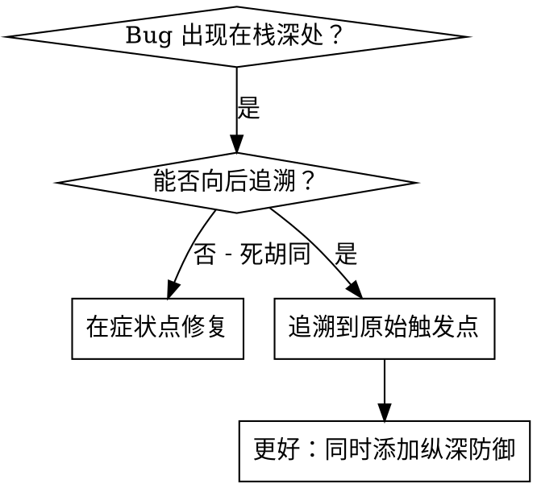
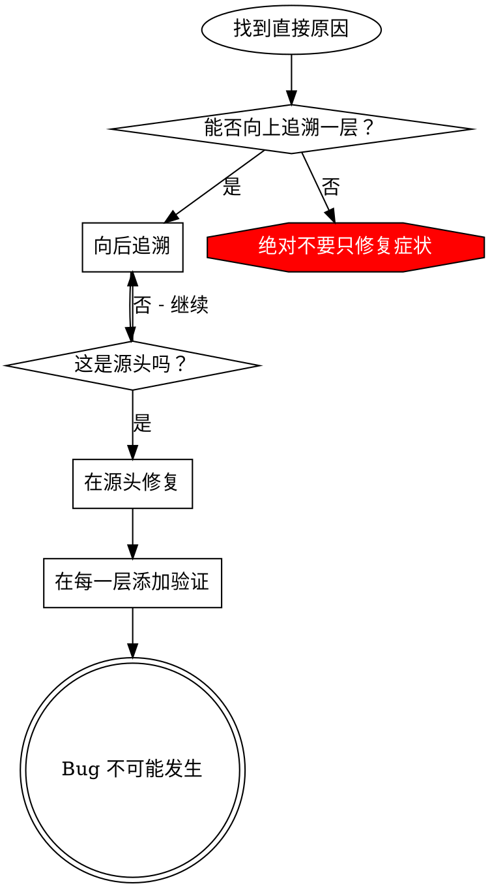

# 根因追溯

## 概述

Bug 通常出现在调用栈深处（git init 在错误的目录中、文件创建在错误的位置、数据库用错误的路径打开）。你的直觉是在错误出现的地方修复，但那是在治疗症状。

**核心原则：** 沿着调用链向后追溯，直到找到最初的触发点，然后在源头修复。

## 何时使用



**在以下情况使用：**
- 错误发生在执行深处（而非入口点）
- 堆栈跟踪显示很长的调用链
- 不清楚无效数据的来源
- 需要找到哪个测试/代码触发了问题

## 追溯过程

### 1. 观察症状
```
Error: git init failed in ~/project/packages/core
```

### 2. 找到直接原因
**是什么代码直接导致了这个错误？**
```typescript
await execFileAsync('git', ['init'], { cwd: projectDir });
```

### 3. 追问：是谁调用了这个？
```typescript
WorktreeManager.createSessionWorktree(projectDir, sessionId)
  → 被 Session.initializeWorkspace() 调用
  → 被 Session.create() 调用
  → 被 Project.create() 处的测试调用
```

### 4. 继续向上追溯
**传递了什么值？**
- `projectDir = ''`（空字符串！）
- 空字符串作为 `cwd` 解析为 `process.cwd()`
- 那是源代码目录！

### 5. 找到原始触发点
**空字符串从哪里来？**
```typescript
const context = setupCoreTest(); // 返回 { tempDir: '' }
Project.create('name', context.tempDir); // 在 beforeEach 之前访问了！
```

## 添加堆栈跟踪

当你无法手动追溯时，添加检测代码：

```typescript
// 在有问题操作之前
async function gitInit(directory: string) {
  const stack = new Error().stack;
  console.error('DEBUG git init:', {
    directory,
    cwd: process.cwd(),
    nodeEnv: process.env.NODE_ENV,
    stack,
  });

  await execFileAsync('git', ['init'], { cwd: directory });
}
```

**关键：** 在测试中使用 `console.error()`（不要用 logger — 可能不显示输出）

**运行并捕获：**
```bash
npm test 2>&1 | grep 'DEBUG git init'
```

**分析堆栈跟踪：**
- 查找测试文件名
- 找到触发调用的行号
- 识别模式（同一个测试？同一个参数？）

## 找到哪个测试造成了污染

如果某些东西在测试期间出现但你不确定是哪个测试造成的：

使用此目录中的二分查找脚本 `find-polluter.sh`：

```bash
./find-polluter.sh '.git' 'src/**/*.test.ts'
```

逐个运行测试，在第一个污染源处停止。查看脚本了解用法。

## 真实案例：空的 projectDir

**症状：** `.git` 创建在 `packages/core/`（源代码）中

**追溯链：**
1. `git init` 在 `process.cwd()` 中运行 ← cwd 参数为空
2. WorktreeManager 被传入空的 projectDir
3. Session.create() 传递了空字符串
4. 测试在 beforeEach 之前访问了 `context.tempDir`
5. setupCoreTest() 最初返回 `{ tempDir: '' }`

**根因：** 顶层变量初始化访问了空值

**修复：** 将 tempDir 做成 getter，如果在 beforeEach 之前访问则抛出错误

**同时添加了纵深防御：**
- 第 1 层：Project.create() 验证目录
- 第 2 层：WorkspaceManager 验证不为空
- 第 3 层：NODE_ENV 守卫拒绝在 tmpdir 之外进行 git init
- 第 4 层：git init 之前记录堆栈跟踪

## 关键原则



**绝对不要只在错误出现的地方修复。** 向后追溯找到原始触发点。

## 堆栈跟踪技巧

**在测试中：** 使用 `console.error()` 而不是 logger — logger 可能被抑制
**在操作之前：** 在危险操作之前记录日志，而不是在它失败之后
**包含上下文：** 目录、cwd、环境变量、时间戳
**捕获堆栈：** `new Error().stack` 显示完整的调用链

## 实际影响

来自调试会话（2025-10-03）：
- 通过 5 层追溯找到根因
- 在源头修复（getter 验证）
- 添加了 4 层防御
- 1847 个测试通过，零污染
