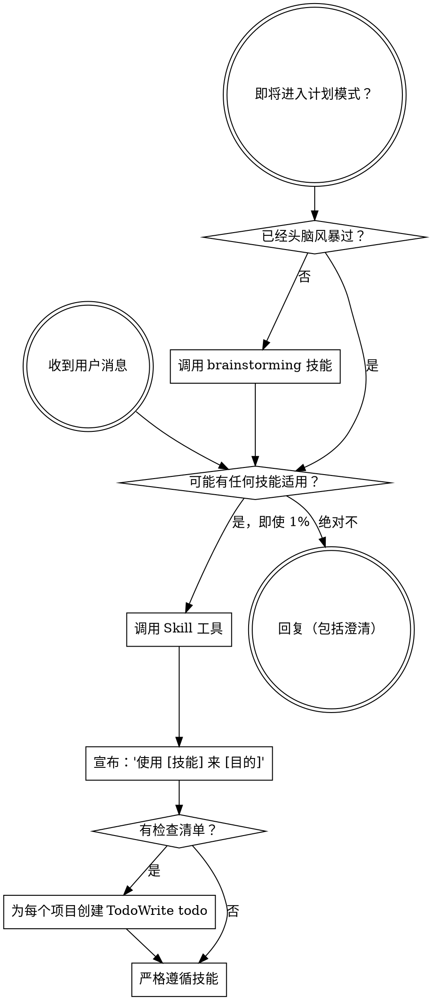

<SUBAGENT-STOP>
如果你被派发为子智能体来执行特定任务，跳过这个技能。
</SUBAGENT-STOP>

<EXTREMELY-IMPORTANT>
如果你认为即使只有 1% 的可能性某个技能适用于你正在做的事情，你绝对必须调用该技能。

如果某个技能适用于你的任务，你没有选择。你必须使用它。

这不是可商量的。这不是可选的。你不能为自己找到合理化借口。
</EXTREMELY-IMPORTANT>

## 指令优先级

Superpowers 技能覆盖默认的系统提示行为，但**用户指令始终优先**：

1. **用户的明确指令**（CLAUDE.md、GEMINI.md、AGENTS.md、直接请求）— 最高优先级
2. **Superpowers 技能** — 在与系统提示冲突时覆盖默认行为
3. **默认系统提示** — 最低优先级

如果 CLAUDE.md、GEMINI.md 或 AGENTS.md 说"不要使用 TDD"，而某个技能说"始终使用 TDD"，遵循用户的指令。用户是掌控者。

## 如何访问技能

**在 Claude Code 中：** 使用 `Skill` 工具。当你调用一个技能时，其内容被加载并呈现给你——直接遵循它。永远不要对技能文件使用 Read 工具。

**在 Copilot CLI 中：** 使用 `skill` 工具。技能从已安装的插件中自动发现。`skill` 工具与 Claude Code 的 `Skill` 工具工作方式相同。

**在 Gemini CLI 中：** 技能通过 `activate_skill` 工具激活。Gemini 在会话开始时加载技能元数据，并按需激活完整内容。

**在其他环境中：** 检查你平台的文档了解技能如何加载。

## 平台适配

技能使用 Claude Code 的工具名。非 CC 平台：参见 `references/copilot-tools.md`（Copilot CLI）、`references/codex-tools.md`（Codex）获取工具等效项。Gemini CLI 用户通过 GEMINI.md 自动加载工具映射。

# 使用技能

## 规则

**在任何回复或行动之前调用相关或被要求的技能。** 即使只有 1% 的可能性某个技能适用，也意味着你应该调用该技能来检查。如果调用的技能最终不适合当前情况，你不需要使用它。

## 红旗

以下想法意味着停止——你在合理化：

| 想法 | 现实 |
|---------|---------|
| "这只是一个简单问题" | 问题就是任务。检查技能。 |
| "我需要更多上下文" | 技能检查在澄清问题之前。 |
| "让我先探索代码库" | 技能告诉你如何探索。先检查。 |
| "我可以快速检查 git/文件" | 文件缺乏对话上下文。检查技能。 |
| "让我先收集信息" | 技能告诉你如何收集信息。 |
| "这不需要正式的技能" | 如果技能存在，使用它。 |
| "我记得这个技能" | 技能会演进。读当前版本。 |
| "这不算一个任务" | 行动 = 任务。检查技能。 |
| "技能是过度杀伤" | 简单的事情会变复杂。使用它。 |
| "我先做这一件事" | 在做任何事之前检查。 |
| "这感觉很高效" | 无纪律的行动浪费时间。技能防止这点。 |
| "我知道那是什么意思" | 知道概念 ≠ 使用技能。调用它。 |

## 技能优先级

当多个技能可能适用时，使用此顺序：

1. **流程技能优先**（brainstorming、debugging）—— 这些决定如何处理任务的方案
2. **实现技能其次**（frontend-design、mcp-builder）—— 这些指导执行

"让我们构建 X" → 首先 brainstorming，然后实现技能。
"修复这个 bug" → 首先 debugging，然后领域特定技能。

## 技能类型

**刚性**（TDD、debugging）：严格遵循。不要调整掉纪律。

**柔性**（patterns）：将原则适配到上下文。

技能本身会告诉你它是哪种。

## 用户指令

指令说的是做什么，而不是怎么做。"添加 X"或"修复 Y"并不意味着跳过工作流。
