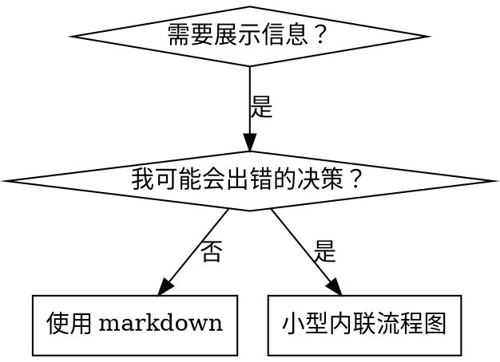

# 编写技能

## 概述

**编写技能就是将 测试驱动开发 应用于流程文档。**

**个人技能存放在智能体特定的目录中（Claude Code 用 `~/.claude/skills`，Codex 用 `~/.agents/skills/`）**

你编写测试用例（带子智能体的压力场景），看着它们失败（基线行为），编写技能（文档），看着测试通过（智能体遵守），然后重构（堵住漏洞）。

**核心原则：** 如果你没有看到智能体在没有技能的情况下失败，你就不知道技能是否教了正确的东西。

**必需的背景：** 在使用本技能之前，你必须理解 superpowers:test-driven-development。那个技能定义了基本的 RED-GREEN-REFACTOR 循环。本技能将 TDD 适配到文档领域。

**官方指导：** 关于 Anthropic 官方的技能编写最佳实践，请参见 anthropic-best-practices.md。该文档提供了额外的模式和指南，对本技能中注重 TDD 的方法形成补充。

## 什么是技能？

**技能** 是经过验证的技术、模式或工具的参考指南。技能帮助未来的 Claude 实例找到并应用有效的方法。

**技能是：** 可复用的技术、模式、工具、参考指南

**技能不是：** 关于你如何解决某个问题一次的叙事

## 技能的 TDD 映射

| TDD 概念 | 技能创建 |
|-------------|----------------|
| **测试用例** | 带子智能体的压力场景 |
| **生产代码** | 技能文档（SKILL.md） |
| **测试失败（RED）** | 智能体在没有技能的情况下违反规则（基线） |
| **测试通过（GREEN）** | 智能体在有技能的情况下遵守 |
| **重构** | 在保持遵守的同时堵住漏洞 |
| **先写测试** | 在编写技能之前运行基线场景 |
| **看着它失败** | 记录智能体使用的确切合理化借口 |
| **最小化代码** | 编写针对这些具体违规的技能 |
| **看着它通过** | 验证智能体现在遵守 |
| **重构循环** | 发现新的合理化 → 堵住 → 重新验证 |

整个技能创建过程遵循 RED-GREEN-REFACTOR。

## 何时创建技能

**在以下情况下创建：**
- 该技术对你来说不是直觉上显而易见的
- 你会在不同项目中再次引用它
- 模式适用范围广泛（不是项目特定的）
- 其他人会受益

**不要为以下情况创建：**
- 一次性解决方案
- 已在别处充分记录的标准实践
- 项目特定的约定（放进 CLAUDE.md）
- 机械性约束（如果可以用正则/验证强制执行，自动化它——把文档留给需要判断的情况）

## 技能类型

### 技术
有步骤可循的具体方法（condition-based-waiting、root-cause-tracing）

### 模式
思考问题的方式（flatten-with-flags、test-invariants）

### 参考
API 文档、语法指南、工具文档（office docs）

## 目录结构


```
skills/
  skill-name/
    SKILL.md              # 主参考文件（必需）
    supporting-file.*     # 仅在需要时
```

**扁平命名空间** - 所有技能在一个可搜索的命名空间中

**独立文件用于：**
1. **重型参考**（100+ 行） - API 文档、全面的语法
2. **可复用工具** - 脚本、工具、模板

**内联保留：**
- 原则和概念
- 代码模式（< 50 行）
- 其他所有内容

## SKILL.md 结构

**Frontmatter（YAML）：**
- 两个必需字段：`name` 和 `description`（所有支持的字段见 [agentskills.io/specification](https://agentskills.io/specification)）
- 总计最多 1024 个字符
- `name`：只使用字母、数字和连字符（不要使用括号、特殊字符）
- `description`：第三人称，仅描述何时使用（而不是它做什么）
  - 以 "Use when..." 开头，聚焦触发条件
  - 包含具体的症状、情况和上下文
  - **绝不总结技能的流程或工作流**（原因见 CSO 部分）
  - 尽量保持在 500 个字符以内

```markdown
---
name: Skill-Name-With-Hyphens
description: Use when [具体的触发条件和症状]
---

# 技能名称

## 概述
这是什么？1-2 句话的核心原则。

## 何时使用
[如果决策不明显，放置小型内联流程图]

包含症状和用例的要点列表
何时不使用

## 核心模式（用于技术/模式）
之前/之后的代码对比

## 快速参考
表格或要点，供扫描常见操作

## 实现
简单模式用内联代码
重型参考或可复用工具用文件链接

## 常见错误
哪里会出错 + 修复方法

## 实际影响（可选）
具体结果
```


## Claude 搜索优化（CSO）

**对可发现性至关重要：** 未来的 Claude 需要能够找到你的技能

### 1. 丰富的描述字段

**目的：** Claude 读取描述来决定为给定任务加载哪些技能。让它回答："我现在应该读这个技能吗？"

**格式：** 以 "Use when..." 开头，聚焦触发条件

**关键：描述 = 何时使用，而不是技能做什么**

描述应该只描述触发条件。不要在描述中总结技能的流程或工作流。

**为什么这很重要：** 测试揭示，当描述总结技能的工作流时，Claude 可能会按照描述操作，而不是阅读完整的技能内容。说"任务之间进行代码审阅"的描述导致 Claude 只做了一次审阅，即使技能流程图明确显示了两阶段审阅（先规格合规性，然后代码质量）。

当描述被改为仅仅是"Use when executing implementation plans with independent tasks"（没有工作流总结）时，Claude 正确阅读了流程图并遵循了两阶段审阅流程。

**陷阱：** 总结工作流的描述创建了 Claude 将走的捷径。技能主体变成了 Claude 跳过的文档。

```yaml
# ❌ 坏：总结工作流 - Claude 可能遵循这个而不是阅读技能
description: Use when executing plans - dispatches subagent per task with code review between tasks

# ❌ 坏：太多流程细节
description: Use for TDD - write test first, watch it fail, write minimal code, refactor

# ✅ 好：只有触发条件，没有工作流总结
description: Use when executing implementation plans with independent tasks in the current session

# ✅ 好：只有触发条件
description: Use when implementing any feature or bugfix, before writing implementation code
```

**内容：**
- 使用具体触发条件、症状和表明此技能适用的情况
- 描述*问题*（竞争条件、不一致的行为）而不是*语言特定的症状*（setTimeout、sleep）
- 保持触发器与技术无关，除非技能本身是技术特定的
- 如果技能是技术特定的，在触发条件中明确说明
- 用第三人称书写（注入到系统提示中）
- **绝不总结技能的流程或工作流**

```yaml
# ❌ 坏：太抽象、模糊，没有包含何时使用
description: For async testing

# ❌ 坏：第一人称
description: I can help you with async tests when they're flaky

# ❌ 坏：提到技术但技能不特定于该技术
description: Use when tests use setTimeout/sleep and are flaky

# ✅ 好：以 "Use when" 开头，描述问题，无工作流
description: Use when tests have race conditions, timing dependencies, or pass/fail inconsistently

# ✅ 好：技术特定的技能，明确的触发条件
description: Use when using React Router and handling authentication redirects
```

### 2. 关键词覆盖

使用 Claude 会搜索的词汇：
- 错误消息："Hook timed out"、"ENOTEMPTY"、"race condition"
- 症状："flaky"、"hanging"、"zombie"、"pollution"
- 同义词："timeout/hang/freeze"、"cleanup/teardown/afterEach"
- 工具：实际的命令、库名、文件类型

### 3. 描述性命名

**使用主动语态，动词优先：**
- ✅ `creating-skills` 而不是 `skill-creation`
- ✅ `condition-based-waiting` 而不是 `async-test-helpers`

### 4. Token 效率（关键）

**问题：** getting-started 和频繁引用的技能会加载到每个会话中。每个 token 都很重要。

**目标字数：**
- getting-started 工作流：每个 <150 词
- 频繁加载的技能：总计 <200 词
- 其他技能：<500 词（仍然保持简洁）

**技巧：**

**将细节移到工具帮助中：**
```bash
# ❌ 坏：在 SKILL.md 中记录所有标志
search-conversations supports --text, --both, --after DATE, --before DATE, --limit N

# ✅ 好：引用 --help
search-conversations supports multiple modes and filters. Run --help for details.
```

**使用交叉引用：**
```markdown
# ❌ 坏：重复工作流细节
When searching, dispatch subagent with template...
[20 行重复的指令]

# ✅ 好：引用其他技能
Always use subagents (50-100x context savings). REQUIRED: Use [other-skill-name] for workflow.
```

**压缩示例：**
```markdown
# ❌ 坏：冗长的示例（42 词）
your human partner: "How did we handle authentication errors in React Router before?"
You: I'll search past conversations for React Router authentication patterns.
[Dispatch subagent with search query: "React Router authentication error handling 401"]

# ✅ 好：最小化示例（20 词）
Partner: "How did we handle auth errors in React Router?"
You: Searching...
[Dispatch subagent → synthesis]
```

**消除冗余：**
- 不要重复被交叉引用的技能中的内容
- 不要解释命令所显而易见的内容
- 不要包含同一模式的多个示例

**验证：**
```bash
wc -w skills/path/SKILL.md
# getting-started 工作流：每个目标 <150
# 其他频繁加载的：总计目标 <200
```

**以你做的事或核心洞察命名：**
- ✅ `condition-based-waiting` > `async-test-helpers`
- ✅ `using-skills` 而不是 `skill-usage`
- ✅ `flatten-with-flags` > `data-structure-refactoring`
- ✅ `root-cause-tracing` > `debugging-techniques`

**动名词（-ing）很适合流程：**
- `creating-skills`、`testing-skills`、`debugging-with-logs`
- 主动的，描述你正在采取的行动

### 4. 交叉引用其他技能

**当编写引用其他技能的文档时：**

只使用技能名称，带有明确的要求标记：
- ✅ 好：`**必需的子技能：** 使用 superpowers:test-driven-development`
- ✅ 好：`**必需的背景：** 你必须理解 superpowers:systematic-debugging`
- ❌ 坏：`See skills/testing/test-driven-development`（不清楚是否是必需的）
- ❌ 坏：`@skills/testing/test-driven-development/SKILL.md`（强制加载，消耗上下文）

**为什么不用 @ 链接：** `@` 语法立即强制加载文件，在你需要它们之前就消耗 200k+ 的上下文。

## 流程图使用



**仅对以下情况使用流程图：**
- 非显而易见的决策点
- 你可能过早停止的流程循环
- "何时使用 A 还是 B"的决策

**绝不要对以下情况使用流程图：**
- 参考材料 → 表格、列表
- 代码示例 → Markdown 块
- 线性指令 → 编号列表
- 无语义意义的标签（step1、helper2）

参见 @graphviz-conventions.dot 了解 graphviz 样式规则。

**为你的 人类搭档 可视化：** 使用此目录中的 `render-graphs.js` 将技能的流程图渲染为 SVG：
```bash
./render-graphs.js ../some-skill           # 每个图单独渲染
./render-graphs.js ../some-skill --combine # 所有图合并在一个 SVG 中
```

## 代码示例

**一个优秀的示例胜过许多平庸的示例**

选择最相关的语言：
- 测试技术 → TypeScript/JavaScript
- 系统调试 → Shell/Python
- 数据处理 → Python

**好的示例：**
- 完整且可运行
- 良好注释，解释为什么
- 来自真实场景
- 清晰地展示模式
- 准备好以供适配（不是通用模板）

**不要：**
- 用 5 种以上语言实现
- 创建填空模板
- 编写人为构造的示例

你擅长移植——一个优秀的示例就够了。

## 文件组织

### 自包含的技能
```
defense-in-depth/
  SKILL.md    # 所有内容内联
```
当：所有内容适合内联，不需要重型参考时

### 带可复用工具的技能
```
condition-based-waiting/
  SKILL.md    # 概述 + 模式
  example.ts  # 可供适配的工作辅助函数
```
当：工具是可复用代码，不只是叙事时

### 带重型参考的技能
```
pptx/
  SKILL.md       # 概述 + 工作流
  pptxgenjs.md   # 600 行 API 参考
  ooxml.md       # 500 行 XML 结构
  scripts/       # 可执行工具
```
当：参考材料太大无法内联时

## 铁律（与 TDD 相同）

```
没有先写失败的测试，不得创建技能
```

这适用于新技能和对现有技能的编辑。

在测试之前写技能？删除它。重新开始。
在没有测试的情况下编辑技能？同样的违规。

**没有任何例外：**
- "简单添加"也不行
- "只是加一节"也不行
- "文档更新"也不行
- 不要将未经测试的更改保留为"参考"
- 不要在运行测试时"调整"
- 删除意味着删除

**必需的背景：** superpowers:test-driven-development 技能解释了为什么这很重要。相同的原则适用于文档。

## 测试所有技能类型

不同的技能类型需要不同的测试方法：

### 纪律执行类技能（规则/要求）

**示例：** TDD、verification-before-completion、designing-before-coding

**用以下方式测试：**
- 学术问题：他们理解规则吗？
- 压力场景：他们在压力下遵守吗？
- 多种压力组合：时间 + 沉没成本 + 疲惫
- 识别合理化借口并添加明确的回应

**成功标准：** 智能体在最大压力下遵循规则

### 技术技能（操作指南）

**示例：** condition-based-waiting、root-cause-tracing、defensive-programming

**用以下方式测试：**
- 应用场景：他们能正确应用技术吗？
- 变体场景：他们处理边缘情况吗？
- 缺失信息测试：指令有缺口吗？

**成功标准：** 智能体成功应用技术到新场景

### 模式技能（心智模型）

**示例：** reducing-complexity、信息隐藏概念

**用以下方式测试：**
- 识别场景：他们能识别出模式何时适用吗？
- 应用场景：他们能使用心智模型吗？
- 反例：他们知道何时不应用吗？

**成功标准：** 智能体正确识别何时/如何应用模式

### 参考技能（文档/API）

**示例：** API 文档、命令参考、库指南

**用以下方式测试：**
- 检索场景：他们能找到正确的信息吗？
- 应用场景：他们能正确使用找到的内容吗？
- 缺口测试：常见用例被涵盖了吗？

**成功标准：** 智能体找到并正确应用参考信息

## 跳过测试的常见合理化借口

| 借口 | 现实 |
|--------|---------|
| "技能显然很清晰" | 对你是清晰的 ≠ 对其他智能体是清晰的。测试它。 |
| "它只是一个参考" | 参考可以有缺口、不清晰的部分。测试检索。 |
| "测试是过度杀伤" | 未经测试的技能总有问题。始终如此。15 分钟测试节省数小时。 |
| "如果出现问题了再测试" | 问题 = 智能体不能使用技能。在部署之前测试。 |
| "测试太繁琐了" | 测试比在生产中调试糟糕的技能要少繁琐得多。 |
| "我很有信心它很好" | 过度自信保证会有问题。无论如何要测试。 |
| "学术审阅就够了" | 阅读 ≠ 使用。测试应用场景。 |
| "没时间测试" | 部署未经测试的技能浪费更多时间在之后修复它。 |

**所有这些意味着：在部署之前测试。没有例外。**

## 防合理化加固——让技能抵御借口

强化纪律的技能（如 TDD）需要抵抗合理化。智能体很聪明，在压力下会找漏洞。

**心理学说明：** 理解说服技巧为什么有效有助于你系统地应用它们。参见 persuasion-principles.md 了解关于权威、承诺、稀缺性、社会认同和统一性原则的研究基础（Cialdini, 2021; Meincke et al., 2025）。

### 明确堵住每一个漏洞

不要只陈述规则——明确禁止具体的变通方法：

<Bad>
```markdown
在测试之前写了代码？删除它。
```
</Bad>

<Good>
```markdown
在测试之前写了代码？删除它。重新开始。

**没有任何例外：**
- 不要保留它作为"参考"
- 不要在写测试时"调整"它
- 不要看它
- 删除意味着删除
```
</Good>

### 回应"精神 vs 字面"的争论

在早期添加基本原则：

```markdown
**违反规则的字面规定就是违反规则的精神。**
```

这切断了整个"我在遵循精神"的合理化借口类别。

### 建立合理化借口表格

从基线测试中捕获合理化（见下方测试部分）。智能体制造的每一个借口都放入表格：

```markdown
| 借口 | 现实 |
|--------|---------|
| "太简单了不需要测试" | 简单的代码也会出错。写测试只需 30 秒。 |
| "我之后再测试" | 立即通过的测试证明不了任何东西。 |
| "事后测试能达到同样目标" | 事后测试 = "这做了什么？" 测试优先 = "这应该做什么？" |
```

### 创建红旗列表

使智能体在合理化时易于自我检查：

```markdown
## 红旗 - 停止并重新开始

- 测试之前写代码
- "我已经手动测试过了"
- "事后测试能达到相同目的"
- "这是精神而不是仪式"
- "这次不同因为…"

**所有这些都意味着：删除代码。用 TDD 重新开始。**
```

### 为违规症状更新 CSO

添加到描述：你即将违反规则时的症状：

```yaml
description: use when implementing any feature or bugfix, before writing implementation code
```

## 技能的 RED-GREEN-REFACTOR

遵循 TDD 循环：

### RED：编写失败的测试（基线）

用子智能体在没有技能的情况下运行压力场景。记录确切的行为：
- 他们做了什么选择？
- 他们使用了什么合理化借口（逐字记录）？
- 哪些压力触发了违规？

这就是"看着测试失败"——你必须在写技能之前看到智能体自然地做什么。

### GREEN：编写最小化技能

编写针对那些具体合理化的技能。不要为假设的情况添加额外内容。

用相同的场景加技能运行。智能体现在应该遵守。

### REFACTOR：堵住漏洞

智能体找到新的合理化？添加明确的回应。重新测试直到坚不可摧。

**测试方法：** 参见 @testing-skills-with-subagents.md 获取完整的测试方法：
- 如何编写压力场景
- 压力类型（时间、沉没成本、权威、疲惫）
- 系统地堵住漏洞
- 元测试技术

## 反模式

### ❌ 叙事示例
"在会话 2025-10-03 中，我们发现空的 projectDir 导致…"
**为什么坏：** 太具体，不可复用

### ❌ 多语言稀释
example-js.js、example-py.py、example-go.go
**为什么坏：** 质量平庸，维护负担

### ❌ 流程图中的代码
```dot
step1 [label="import fs"];
step2 [label="read file"];
```
**为什么坏：** 无法复制粘贴，难以阅读

### ❌ 通用标签
helper1、helper2、step3、pattern4
**为什么坏：** 标签应有语义意义

## 停止：在进入下一个技能之前

**在编写任何技能之后，你必须停止并完成部署流程。**

**不要：**
- 批量创建多个技能而不逐个测试
- 在当前技能被验证之前进入下一个技能
- 因为"批处理更高效"而跳过测试

**下面的部署检查清单对每个技能是强制的。**

部署未经测试的技能 = 部署未经测试的代码。这是对质量标准的违反。

## 技能创建检查清单（TDD 适配）

**重要：使用 TodoWrite 为下面每个检查清单项目创建 todo。**

**RED 阶段 - 编写失败的测试：**
- [ ] 创建压力场景（纪律技能需要 3+ 个组合压力）
- [ ] 在没有技能的情况下运行场景 - 逐字记录基线行为
- [ ] 识别合理化/失败中的模式

**GREEN 阶段 - 编写最小化技能：**
- [ ] 名称只使用字母、数字、连字符（没有括号/特殊字符）
- [ ] YAML frontmatter 带有必需的 `name` 和 `description` 字段（最多 1024 字符；见 [规范](https://agentskills.io/specification)）
- [ ] 描述以 "Use when..." 开头并包含具体的触发条件/症状
- [ ] 描述用第三人称书写
- [ ] 全文有关键词供搜索（错误、症状、工具）
- [ ] 清晰的概述与核心原则
- [ ] 处理 RED 中识别出的具体基线失败
- [ ] 代码内联或链接到独立文件
- [ ] 一个优秀的示例（不是多语言）
- [ ] 用技能运行场景 - 验证智能体现在遵守

**REFACTOR 阶段 - 堵住漏洞：**
- [ ] 从测试中识别新的合理化
- [ ] 添加明确的回应（如果是纪律技能）
- [ ] 从所有测试迭代中建立合理化借口表格
- [ ] 创建红旗列表
- [ ] 重新测试直到坚不可摧

**质量检查：**
- [ ] 仅在决策非显而易见时使用小型流程图
- [ ] 快速参考表格
- [ ] 常见错误部分
- [ ] 没有叙事性故事
- [ ] 辅助文件仅用于工具或重型参考

**部署：**
- [ ] 将技能提交到 git 并推送到你的 fork（如果已配置）
- [ ] 考虑通过 PR 贡献回去（如果广泛有用）

## 发现工作流

未来的 Claude 如何找到你的技能：

1. **遇到问题**（"测试不稳定"）
3. **找到技能**（描述匹配）
4. **扫描概述**（这个相关吗？）
5. **阅读模式**（快速参考表格）
6. **加载示例**（仅在实际实现时）

**针对此流程优化** - 尽早并经常放置可搜索的术语。

## 底线

**创建技能就是应用于流程文档的 TDD。**

相同的铁律：没有先写失败的测试，不得创建技能。
相同的循环：RED（基线）→ GREEN（编写技能）→ REFACTOR（堵住漏洞）。
相同的好处：更好的质量，更少的意外，坚不可摧的结果。

如果你对代码遵循 TDD，对技能也遵循 TDD。这是应用于文档的相同纪律。
